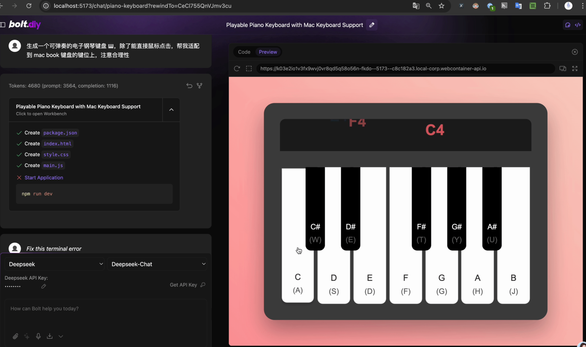

# Piano Keyboard App



## Table of Contents

- [Introduction](#introduction)
- [Features](#features)
- [How to Run](#how-to-run)
- [Switch to Chinese](#switch-to-chinese)

## Introduction

This project is a playable piano keyboard developed using b[**olt.**](https://github.com/stackblitz-labs/bolt.diy)diy + d[**eepseek V3**](https://www.deepseek.com/). It supports both mouse clicks and keyboard input, with a MacBook-style touchbar for visual feedback.

## Features

1. **Playable Keyboard**
   - Supports mouse clicks and keyboard input with logical key mapping.
2. **MacBook-style Touchbar**
   - Displays animated notes when keys are pressed.
3. **Enhanced Visuals**
   - Notes appear in vibrant colors and fade out gradually.
   - Multiple notes can be displayed simultaneously on the touchbar.
4. **Key Mapping Hints**
   - Shows the corresponding keyboard keys on the piano for easy reference.
5. **Responsive Design**
   - Optimized size for better display on large screens.

## How to Run

1. Install dependencies:
   ```bash
   npm install
   ```
2. Start the development server:
   ```bash
   npm run dev
   ```
3. Open your browser and visit `http://localhost:5173`.

## Switch to Chinese

[View Chinese Version](README_CN.md)
